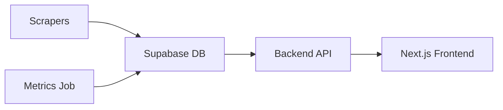

# Architecture

This document describes the Phase 1 architecture for Recruiter Market Brief.

## Overview

- Scrapers pull job postings from ATS platforms via Apify.
- Normalized job data is written into Supabase Postgres (`job_postings` table).
- Metrics jobs aggregate data into `weekly_metrics`.
- A Next.js frontend reads metrics via the backend API (future) or directly via Supabase-backed endpoints.

## Directories

- `backend/` – Python code for scrapers, processors, metrics, and config.
- `database/` – SQL schema and migrations applied via Supabase.
- `config/` – Company and taxonomy configuration used by scrapers/processors.
- `frontend/` – Next.js app for visualizing key metrics and the brief.
- `scripts/` – Operational entrypoints used locally and in GitHub Actions.
